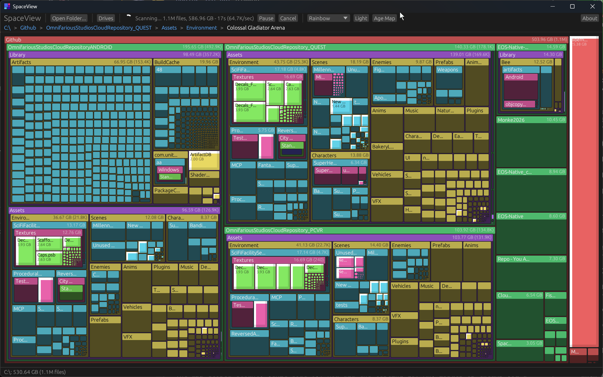
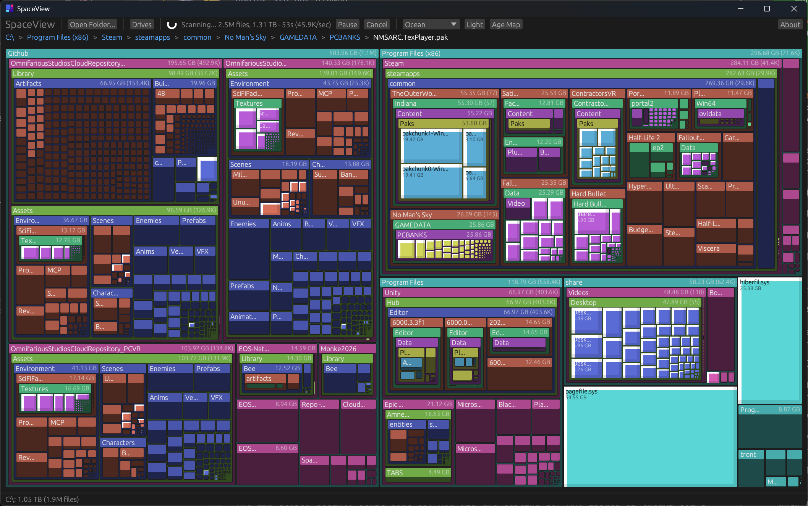
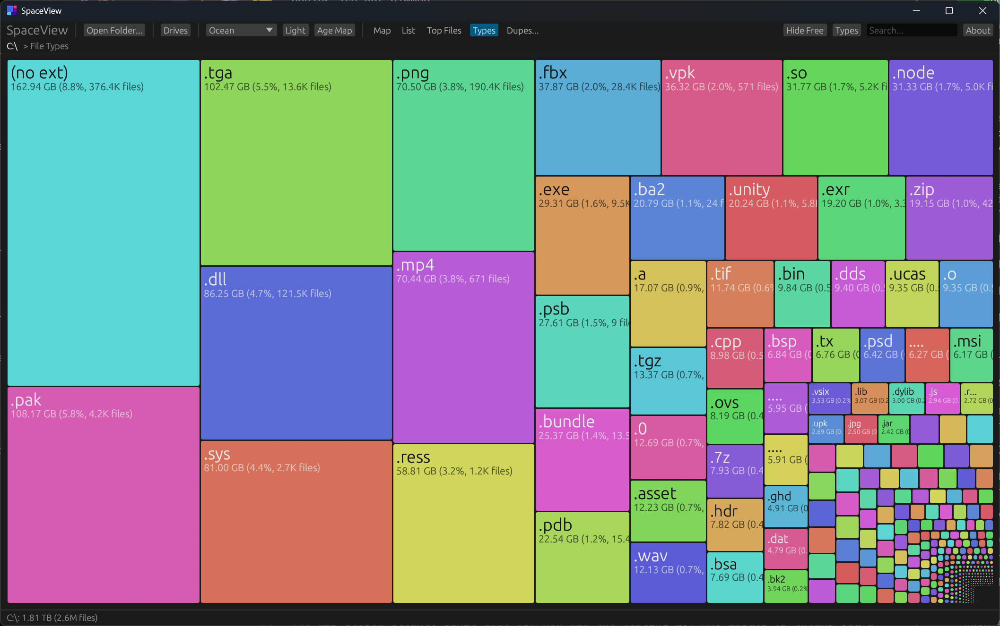

<p align="center">
  
</p>

<h1 align="center">SpaceView</h1>

<p align="center">
  <strong>See where your disk space goes.</strong><br>
  A fast, visual disk space analyzer inspired by <a href="https://en.wikipedia.org/wiki/SpaceMonger">SpaceMonger</a>.
</p>

<p align="center">
  
  
  
  
  
</p>

<p align="center">
  <a href="https://github.com/TrentSterling/spaceview/releases/latest">Download Latest Release</a>
</p>

---

<p align="center">
  
</p>

<p align="center">
  
</p>

<p align="center">
  
</p>

---

## Features

- **Treemap Visualization.** Squarified layout shows files and folders as proportionally-sized rectangles. Vivid SpaceMonger-style colors. Cushion shading for 3D depth.
- **Live Scan.** Treemap builds progressively as directories are discovered. Pause, resume, cancel. Drag-and-drop folders.
- **5 View Modes.** Map (treemap), List (sortable directory browser), Top Files (1000 largest), Types (extension treemap), Duplicates. Switch instantly via tabs.
- **Drive Picker.** Visual drive cards with capacity bars on the welcome screen. Click any drive to scan. Toolbar button opens the picker anytime.
- **Extension Breakdown Panel.** Side panel listing every file type by size. Click an extension to highlight matching files in the treemap. Everything else dims.
- **3 Color Modes.** Color by depth, file age (log-scale heatmap), or file extension. 3 themes: Rainbow, Neon, Ocean. Dark/light mode.
- **Duplicate Detection.** Background tiered hashing (size, partial, full). Groups sorted by wasted space. Delete duplicates to reclaim disk.
- **Search/Filter.** Find files by name or path across List, Top Files, Duplicates, and the extension panel.
- **Right-Click Context Menu.** Open in Explorer, Copy Path, Delete to Recycle Bin. Works in all views.
- **Rich Tooltips.** Hover any block for name, size, percentage, file count, and full path.
- **Built for huge drives.** Folder layouts are computed once and cached, the whole treemap draws as a single batched mesh, and memory is hard-capped. Multi-million-file scans stay smooth.
- **Portable.** One ~7 MB .exe. No installer, no runtime dependencies. Download, run, delete to uninstall.

## Quick Start

### Download

Grab the latest `spaceview.exe` from the [Releases](https://github.com/TrentSterling/spaceview/releases/latest) page. No installation required. Just run it.

### Build from Source

```bash
git clone https://github.com/TrentSterling/spaceview.git
cd spaceview
cargo build --release
```

The binary will be at `target/release/spaceview.exe`.

**Requirements:** [Rust](https://rustup.rs/) (edition 2021)

## Navigation

| Input | Action |
|-------|--------|
| **Scroll** | Zoom in/out at cursor position |
| **Double-click** | Snap zoom into a folder |
| **Right-click** | Context menu (or zoom out on empty space) |
| **Drag** | Pan the view |
| **Backspace / Esc** | Zoom out to parent |
| **Breadcrumbs** | Click any breadcrumb to jump there |

## How It Works

SpaceView scans your selected drive or folder, then displays a [squarified treemap](https://www.win.tue.nl/~vanwijk/stm.pdf) where each rectangle's area is proportional to its file/folder size. Larger items are immediately visible. You can spot space hogs at a glance.

Each folder's layout is computed once when it comes into view, cached, and reused every frame. Every rectangle in the treemap draws as part of one batched mesh (cushion shading is a per-vertex gradient), so even tens of thousands of visible blocks cost the renderer a single draw.

### Architecture

```
src/
  main.rs          Entry point, eframe window setup, panic log
  app.rs           Main UI: rendering, hit testing, input, themes, drive picker, extension panel
  camera.rs        Bounded camera with smooth zoom/pan/snap animations
  scanner.rs       Recursive directory scanner with progress tracking and live snapshots
  world_layout.rs  Lazy LOD layout tree: expand/prune on demand, cached layouts, node budget
  treemap.rs       Squarified treemap algorithm (Bruls et al.)
  stress.rs        Perf harness: --synthetic N fake tree + --stress S scripted camera thrash
```

**Key design decisions:**
- Cached layouts. A folder's squarified subdivision depends only on its children's relative sizes, so it's computed once and reused under any camera.
- One batched mesh. All fills, borders, and headers accumulate into a single vertex-colored mesh per frame; text draws on top.
- Lazy level-of-detail. Only expand visible directories, prune off-screen ones, cap expansion at 2048 children per folder with a global 250k node budget.
- Bounded camera. Zoom clamped to [1x, 5000x], pan clamped to world bounds, frame-rate-independent smoothing.
- Live scanning. Partial tree snapshots streamed via mpsc channel, throttled to 2/sec.
- Deferred drops. Old trees freed on background thread to prevent UI stalls.
- Crash visibility. Panics write to `%APPDATA%/SpaceView/panic.log` with a backtrace.

## Tech Stack

| | |
|---|---|
| Language | Rust (edition 2021) |
| UI Framework | [eframe](https://github.com/emilk/egui)/[egui](https://github.com/emilk/egui) 0.31 |
| File Dialog | [rfd](https://github.com/PolyMeilex/rfd) 0.15 |
| System Info | [sysinfo](https://github.com/GuillaumeGomez/sysinfo) 0.33 |
| HTTP | [ureq](https://github.com/algesten/ureq) 2 |
| Treemap | Squarified (Bruls, Huizing, van Wijk) |

## Acknowledgments

Inspired by [SpaceMonger](https://en.wikipedia.org/wiki/SpaceMonger) by Sean Werkema. The original treemap disk visualizer for Windows.

## License

MIT License. See [LICENSE](LICENSE) for details.

---

<p align="center">
  Made by <a href="https://github.com/TrentSterling">tront</a> | <a href="https://tront.xyz/spaceview/">Website</a> | <a href="https://blog.tront.xyz/posts/spaceview/">Blog Post</a>
</p>
